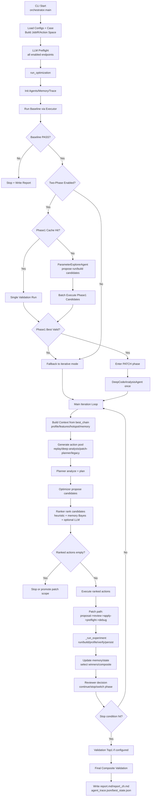

# Orchestrator Runtime Flow (Current Implementation)

## 1) End-to-End Flow



## 2) Single Iteration Internal Loop

```mermaid
flowchart TD
    A0[Iteration Start] --> A1[should_stop check<br/>iters/runs/wall/no-improve]
    A1 --> A2[Rebuild effective ctx from best_chain]
    A2 --> A3[Resolve phase targets<br/>RUN_TUNE/BUILD_TUNE/RUN_RETUNE/PATCH]
    A3 --> A4[Patch scope + navigation hints + hotspot files]
    A4 --> A5[Planner.analyze -> AnalysisResult]
    A5 --> A6[Planner.plan -> PlanIR]
    A6 --> A7[Optimizer.propose -> CandidateList[]]
    A7 --> A8[ExperienceMemory.bayesian_posteriors]
    A8 --> A9[Ranker.rank -> RankedActions]
    A9 --> A10{Have executable actions?}
    A10 -- No --> A11[Scope promotion or stop]
    A10 -- Yes --> A12[for each action execute]

    A12 --> B1{source_patch?}
    B1 -- No --> B2[executor.execute]
    B1 -- Yes --> B3[CodePatchAgent/Agentic<br/>propose patch]
    B3 --> B4[format + deterministic review<br/>optional llm review]
    B4 --> B5[patch apply check]
    B5 --> B6[preflight compile]
    B6 --> B7{preflight ok?}
    B7 -- No --> B8[PatchDebug retry / block action]
    B7 -- Yes --> B2

    B2 --> C1[VerifierAgent.verify]
    C1 --> C2[Record ExperimentIR + manifest + run trace]
    C2 --> C3[Update run_count/fail_count/tested actions]

    C3 --> D1[Select non-conflicting winners]
    D1 --> D2{Multiple winners?}
    D2 -- Yes --> D3[Try iter-composite]
    D2 -- No --> D4[Update best_chain to single winner]
    D3 --> D4
    D4 --> D5[Patch reflection/scope counters]
    D5 --> D6[Reviewer.review payload]
    D6 --> D7{switch_family?}
    D7 -- Yes --> D8[Phase transition + freeze IDs]
    D7 -- No --> D9[Stay in phase]
    D8 --> E0[Next iteration]
    D9 --> E0
```

## 3) Key Persisted Outputs per Run

- `artifacts/sessions/<session_id>/runs/<run_id>/experiment.json`
- `artifacts/sessions/<session_id>/runs/<run_id>/manifest.json`
- `artifacts/sessions/<session_id>/runs/<run_id>/agent_trace.json`
- `artifacts/sessions/<session_id>/ledger/run_index.jsonl`
- `artifacts/sessions/<session_id>/agent_trace.json`
- `artifacts/sessions/<session_id>/best_state.json`
- `artifacts/sessions/<session_id>/report.md`
- `artifacts/sessions/<session_id>/report_zh.md`
